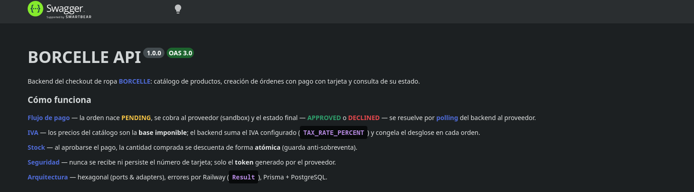
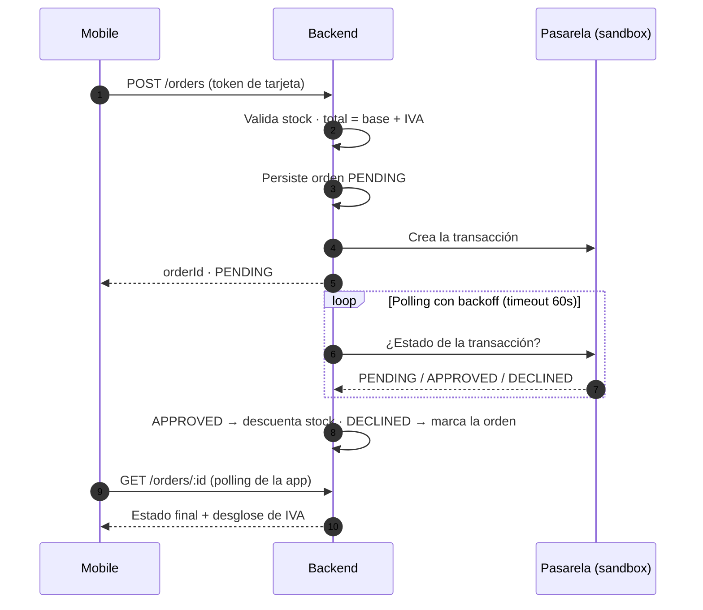

# Borcelle — Backend

API de <span style="color:#4F6BD8"><b>checkout y pagos</b></span> para **BORCELLE**, la boutique de ropa. Construida con **NestJS + TypeScript** en <span style="color:#4F6BD8"><b>arquitectura hexagonal</b></span> (ports & adapters), errores por **Result** (railway), **Prisma 7** sobre **PostgreSQL** y una pasarela de pago *sandbox* resuelta por <span style="color:#4F6BD8"><b>polling</b></span> — nunca webhooks.


> **API en vivo:** [`borcelle-api.ondeploy.store`](https://borcelle-api.ondeploy.store/health) · **Swagger:** [`/docs`](https://borcelle-api.ondeploy.store/docs)



## ⚡ Flujo de la app (simplificado)



1. La orden nace <span style="color:#F6C445"><b>PENDING</b></span>: una orden = **un producto**, total = base + <span style="color:#4F6BD8"><b>IVA</b></span>.
2. Se cobra a la pasarela con la tarjeta <span style="color:#4F6BD8"><b>tokenizada</b></span> (el número de tarjeta **jamás** toca esta API).
3. Un <span style="color:#4F6BD8"><b>polling</b></span> en segundo plano (backoff exponencial, timeout 60s, rehidratación al reiniciar) resuelve el estado final: <span style="color:#2E9E6B"><b>APPROVED</b></span> o <span style="color:#E5484D"><b>DECLINED</b></span>.
4. Al aprobar, el stock se descuenta de forma <b>atómica</b> (guarda `stock >= qty` anti-sobreventa).
5. La app consulta `GET /orders/:id` hasta el estado terminal — el backend nunca la notifica: **ella pregunta**.

## ✨ Features

- <span style="color:#4F6BD8"><b>Catálogo</b></span> — productos con precio base en centavos, stock, moneda y la <span style="color:#4F6BD8"><b>tasa de IVA</b></span> vigente; fotos servidas por la propia API bajo `/static`.
- <span style="color:#4F6BD8"><b>Pagos tokenizados</b></span> — integración sandbox con *acceptance token* y firma de integridad SHA-256; solo viaja el token de la tarjeta.
- <span style="color:#4F6BD8"><b>IVA sobre la base</b></span> — `TAX_RATE_PERCENT` configurable; el desglose (tasa + centavos) se **congela por orden**, inmune a cambios futuros.
- <span style="color:#4F6BD8"><b>Polling resiliente</b></span> — backoff exponencial con tope 15s, timeout 60s y rehidratación de órdenes `PENDING` al arrancar.
- <span style="color:#4F6BD8"><b>Stock atómico</b></span> — aprobación y descuento en una única transacción Prisma con guarda anti-sobreventa e idempotencia.
- <span style="color:#4F6BD8"><b>Delivery</b></span> — cada orden persiste su snapshot de envío completo.
- <span style="color:#4F6BD8"><b>Hardening</b></span> — Helmet, CORS por lista, rate limiting y validación estricta (`whitelist` + `forbidNonWhitelisted`).
- <span style="color:#4F6BD8"><b>Swagger en español</b></span> — palabras clave resaltadas y ejemplos realistas por endpoint y por código de error: [`/docs`](https://borcelle-api.ondeploy.store/docs).
- <span style="color:#4F6BD8"><b>Errores railway</b></span> — `Result<T, AppError>` en el núcleo (sin `throw`); códigos tipados mapeados a HTTP en el borde (`400/404/409/502/500`).

## 🏗️ Arquitectura

Hexagonal *layer-first*: las capas viven en la raíz de `src/` y un único `app.module.ts` cablea los puertos.

```text
src/
├── domain/            # entidades, value objects (Money), servicios (Tax, OrderStatus), puertos
├── application/       # casos de uso, DTOs (class-validator), resolvers
├── infrastructure/    # adapters (inbound/http, outbound/persistence, outbound/payments) + config
└── shared/            # Result (railway) + AppError
```

- El <b>dominio</b> no importa framework (`@nestjs/*` / `@prisma/client`).
- Acceso a datos por <b>puerto</b>; Prisma solo vive en `adapters/outbound/persistence`.

## 🗃️ Modelo de datos

`Product` · `Customer` · `Order` (con desglose de IVA) · `Transaction` · `Delivery` + enum `OrderStatus`. Schema en [`prisma/schema.prisma`](prisma/schema.prisma); seed de 10 conjuntos streetwear con fotos propias en [`prisma/seed.ts`](prisma/seed.ts).

## 🌐 Endpoints

| Método | Ruta | Descripción |
|---|---|---|
| `GET` | `/health` | Sonda de vida |
| `GET` | `/products` | Catálogo (precio base + tasa de IVA) |
| `GET` | `/products/:id` | Detalle de producto |
| `POST` | `/orders` | Crear orden + iniciar pago |
| `GET` | `/orders/:id` | Estado + desglose de la orden (endpoint de polling de la app) |
| `GET` | `/static/*` | Fotos del catálogo |

**Swagger UI:** [`https://borcelle-api.ondeploy.store/docs`](https://borcelle-api.ondeploy.store/docs) (producción) · `http://localhost:3000/docs` (local) · **OpenAPI JSON:** `/docs-json`

## 🔧 Variables de entorno

```bash
cp .env.example .env   # completar credenciales sandbox (nunca dinero real)
```

| Variable | Descripción |
|---|---|
| `DATABASE_URL` | Cadena de conexión PostgreSQL |
| `PORT` | Puerto HTTP (default 3000) |
| `PAYMENTS_BASE_URL` | URL sandbox de la pasarela |
| `PAYMENTS_PUBLIC_KEY` / `PAYMENTS_PRIVATE_KEY` | API keys (sandbox) |
| `PAYMENTS_INTEGRITY_SECRET` | Secreto de la firma de integridad |
| `PAYMENTS_ACCEPTANCE_TOKEN` | Opcional (si falta se obtiene del endpoint de merchants) |
| `TAX_RATE_PERCENT` | Tasa de IVA aplicada sobre la base (ej. `18`) |
| `BASE_FEE_IN_CENTS` / `DELIVERY_FEE_IN_CENTS` | Tarifas |
| `CORS_ORIGINS`, `RATE_LIMIT_*`, `SWAGGER_*` | Hardening y docs |

> El `.env` está en `.gitignore` — los secretos nunca se commitean.

## 🚀 Puesta en marcha

**Local:**

```bash
pnpm install
cp .env.example .env             # completar credenciales sandbox
docker compose up -d db          # PostgreSQL local
pnpm prisma migrate deploy       # aplicar migraciones
pnpm db:seed                     # sembrar el catálogo
pnpm start:dev                   # API en watch (http://localhost:3000)
```

**Docker (todo incluido):**

```bash
cp .env.example .env
docker compose up --build -d                  # db + api (migraciones al arrancar)
docker compose --profile seed run --rm seed   # sembrar el catálogo (una vez)
curl http://localhost:3000/health
```

## ✅ Tests

```bash
pnpm test        # unitarios + integración
pnpm test:e2e    # end-to-end (requiere Postgres)
pnpm test:cov    # cobertura (umbral 80% en las 4 métricas)
```

| Métrica | % |
|---|---|
| Statements | **95.03%** |
| Branches | **83.07%** |
| Functions | **94.57%** |
| Lines | **94.85%** |

159 tests · 26 suites (unit + integración) + 5 e2e · umbral mínimo forzado: **80%**.

## 📜 Scripts

```bash
pnpm start:dev      # desarrollo (watch)
pnpm build          # compila a dist/
pnpm start:prod     # node dist/src/main.js
pnpm prisma migrate dev --name <slug>   # nueva migración (dev)
pnpm db:seed        # sembrar datos
pnpm lint           # eslint --fix
```

---

El cliente de esta API vive en [`Boutique-Mobile`](../Boutique-Mobile/README.md) — app React Native con el checkout completo, facturas cifradas y el catálogo BORCELLE.
